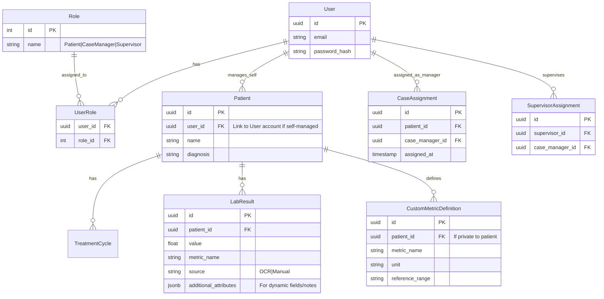

# OncoTracker Full Stack Implementation Plan

## 1. Executive Summary

This document outlines the roadmap for transitioning **OncoTracker** from a standalone HTML prototype to a robust, multi-platform full-stack application. The goal is to provide a seamless experience across **macOS, Windows, iOS, and Android**, featuring secure data storage, real-time synchronization, and advanced AI capabilities using **open-source models (Qwen, PaddleOCR)** for global accessibility and privacy.

## 2. Technology Stack

### Frontend (Multi-Platform)

To ensure code reusability and a consistent "premium" UI across all platforms, we will use the **React Ecosystem**.

* **Core Framework:** **React** (TypeScript).
* **Mobile (iOS & Android):** **React Native** with **Expo**. Allows native performance and access to device features (camera for scanning).
* **Desktop (macOS & Windows):1. **Executive Summary**: The AI capabilities are now explicitly mentioned as using "open-source models (Qwen, PaddleOCR)" for "global accessibility and privacy".

2. **Technology Stack**:
    * **Authentication**: `Auth0` is replaced with `Keycloak (Self-hosted option) for RBAC`.
    * **Object Storage**: `Supabase Storage` is replaced with `MinIO (Self-hosted S3 compatible)`.
    * **Vector DB**: `Pinecone` is removed, leaving only `pgvector`.
    * **AI & Data Processing**: This section is completely rewritten to focus on open-source solutions:
        * `OCR Engine`: Changed from `Google Cloud Vision API` or `Azure AI Vision` to `PaddleOCR` with a specific reason for its choice (table recognition).
        * `LLM Integration`: Changed from `Gemini Pro` or `GPT-4o` to `Qwen-72B-Chat`, with a plan for initial API use and later self-hosting with `vLLM` or `Ollama` for data sovereignty.
3. **Architecture Flow Chart**:
    * `Auth Service`: Updated to `(Supabase/Keycloak)`.
    * `DB`: Updated to `(PostgreSQL\nPatient Data + RBAC)`.
    * `Storage`: Updated to `(MinIO/S3\nMedical Reports)`.
    * The `External AI` subgraph is replaced by `Open Source AI Stack` with `Qwen-72B Service` and `PaddleOCR Service`.
    * The connections `AI_Svc --> OCR` and `AI_Svc --> LLM` are updated to reflect the new AI services.
4. **New Section: User Journey & Roles**: This is a completely new section detailing three user personas (Patient, Case Manager, Supervisor) with their respective permissions and functionalities, laying the groundwork for RBAC.
5. **Database Design (ER Diagram)**:
    * The section title is updated to `Database Design (RBAC Schema)`.
    * The ER diagram is significantly expanded to include `Role`, `UserRole`, `CaseAssignment`, and `SupervisorAssignment` entities, reflecting the new RBAC structure.
    * The `User` and `Patient` entities are modified to support the new role-based access and patient management.
    * The `TreatmentCycle`, `LabResult`, `ClinicalEvent`, and `Document` entities are simplified or removed from this specific RBAC schema view, focusing on the core RBAC relationships.
6. **AI Involvement: Smart Scan Pipeline**: This section is renamed to `AI Involvement: Open Source Smart Scan` and completely rewritten to reflect the use of `PaddleOCR` for table extraction and `Qwen-72B` for semantic parsing, including details on their specific roles and benefits.
7. **Cloud-Based Deployment Design**: This section remains largely unchanged, but the `{{ ... }}` indicates that the content within the original document should be preserved.

This comprehensive update shifts the plan towards a more open-source and privacy-focused AI strategy, introduces a detailed Role-Based Access Control (RBAC) system, and refines the architecture and database design accordingly.

```
# OncoTracker Full Stack Implementation Plan

## 1. Executive Summary

This document outlines the roadmap for transitioning **OncoTracker** from a standalone HTML prototype to a robust, multi-platform full-stack application. The goal is to provide a seamless experience across **macOS, Windows, iOS, and Android**, featuring secure data storage, real-time synchronization, and advanced AI capabilities using **open-source models (Qwen, PaddleOCR)** for global accessibility and privacy.

## 2. Technology Stack

### Frontend (Multi-Platform)

To ensure code reusability and a consistent "premium" UI across all platforms, we will use the **React Ecosystem**.

*   **Core Framework:** **React** (TypeScript).
*   **Mobile (iOS & Android):** **React Native** with **Expo**. Allows native performance and access to device features (camera for scanning).
*   **Desktop (macOS & Windows):** **Electron** or **Tauri** wrapping a React application. This ensures the desktop app feels native while sharing 90% of the code with the web/mobile versions.
*   **State Management:** **TanStack Query** (server state) + **Zustand** (client state).
*   **Visualization:** **D3.js** (reusing the existing robust logic) wrapped in React components.

### Backend (API & AI)

*   **Language:** **Python**. Chosen for its dominance in AI/ML and data processing.
*   **Framework:** **FastAPI**. High-performance, easy to document (OpenAPI), and async support.
*   **Authentication:** **Supabase Auth** or **Keycloak** (Self-hosted option) for RBAC.

### Database & Storage

*   **Relational DB:** **PostgreSQL**. For structured patient data, treatment cycles, and events.
*   **Object Storage:** **MinIO** (Self-hosted S3 compatible) or **AWS S3**. For storing raw medical report images and PDFs.
*   **Vector DB:** **pgvector** (within Postgres). For semantic search over medical notes.

### AI & Data Processing (Open Source)

*   **OCR Engine:** **PaddleOCR**. Selected for its superior performance in **table recognition**, crucial for parsing medical lab reports.
*   **LLM Integration:** **Qwen-72B-Chat**.
    *   *Initial Phase:* Use API providers (e.g., Together AI, Alibaba Cloud) for rapid development.
    *   *Production/Privacy Phase:* Self-host using **vLLM** or **Ollama** on GPU instances for complete data sovereignty.

## 3. Architecture Flow Chart

```mermaid
graph TD
    subgraph "Client Layer (Multi-Platform)"
        Mobile[iOS / Android App\n(React Native)]
        Desktop[macOS / Windows App\n(Electron/Tauri)]
        Web[Web Dashboard\n(React)]
    end

    subgraph "API Gateway & Security"
        LB[Load Balancer]
        Auth[Auth Service\n(Supabase/Keycloak)]
    end

    subgraph "Backend Services (Python/FastAPI)"
        API[Core API Service]
        Worker[Async Task Queue\n(Celery/Redis)]
        AI_Svc[AI Processing Service]
    end

    subgraph "Data Layer"
        DB[(PostgreSQL\nPatient Data + RBAC)]
        Storage[(MinIO/S3\nMedical Reports)]
        Cache[(Redis\nCaching)]
    end

    subgraph "Open Source AI Stack"
        LLM[Qwen-72B Service\n(vLLM / API)]
        OCR[PaddleOCR Service\n(Containerized)]
    end

    Mobile --> LB
    Desktop --> LB
    Web --> LB
    LB --> API
    API --> Auth
    API --> DB
    API --> Worker
    Worker --> AI_Svc
    AI_Svc --> OCR
    AI_Svc --> LLM
    AI_Svc --> DB
    Mobile -- Upload Scan --> Storage
```

## 4. User Journey & Roles

The system is designed around three distinct user personas with hierarchical permissions.

### A. Patient (Self-Service)

* **Onboarding:** Sign up via email/phone.
* **Initial Setup (Self-Entry):**
  * **Manual Input:** Upon first login, patients can use the same **Dynamic Form** as Case Managers to input their historical treatment data and baseline metrics.
* **Ongoing Management:**
  * **Smart Auto-Update:** For new lab tests, patients simply upload a photo/PDF. The AI pipeline extracts the data and automatically updates their timeline.
  * **View:** Access *only* their own timeline and metrics.
  * **Alerts:** Receive reminders for upcoming cycles or medication.
* **Privacy:** Data is strictly siloed; they cannot see other patients.

### B. Case Manager (Professional)

* **Patient Management:**
  * **Add Patient:** Create accounts for new patients.
  * **Assignment:** View and manage patients assigned to them.
  * **Data Entry (Dynamic Form):**
    * **Pre-set Fields:** Input standard data (Date, Cycle, Scheme, Core Metrics like CA724, CEA) based on the `formal_dataset` structure.
    * **Extensibility:** "Add Custom Metric" button to input new indicators (e.g., "IL-6", "Ferritin") on the fly. These are saved and become available for future entries.
    * **Event Logging:** Add custom clinical events (e.g., "Adverse Reaction", "Surgery") with free-text notes.
* **Dashboard:**
  * **Overview:** List of all assigned patients with status indicators (e.g., "Cycle 3 Due", "High Risk").
  * **Alerts:** Notifications for abnormal lab results or missed check-ins.
* **Analysis:** View detailed charts for any assigned patient.

### C. Supervisor (Admin/Director)

* **Team Management:**
  * **Assign:** Assign patients to Case Managers.
  * **Monitor:** View activity logs of Case Managers.
* **Global Dashboard:**
  * **Stats:** Aggregate view of all patients (e.g., "Total Active Patients", "Treatment Success Rates").
  * **Oversight:** Access any patient record for second opinions or audit.
* **Configuration:** Manage system-wide settings (e.g., new drug schemes, metric thresholds).

## 5. Database Design (RBAC Schema)



## 6. AI Involvement: Open Source Smart Scan

2. **Preprocessing:** OpenCV for deskewing and contrast enhancement.
3. **Table Extraction (PaddleOCR):**
    * Detect table boundaries in the lab report.
    * Extract text with spatial coordinates to reconstruct rows/columns.
4. **Semantic Parsing (Qwen-72B):**
    * *Prompt:* "Analyze this OCR table data. Identify columns for 'Test Name', 'Result', 'Unit'. Extract 'CA724', 'CEA', 'WBC'. Return JSON."
    * *Reasoning:* Qwen's strong multilingual and reasoning capabilities allow it to handle non-standard report formats better than regex.
5. **Validation:** Check values against standard medical ranges.

## 7. Future Scalability: AI & Community

The architecture is designed to support advanced features in Phase 2+.

### A. Advanced AI Integrations (RAG Pipeline)

To support **Drug Information**, **Scheme Comparison**, and **NCCN/CSCO Guidance Search**, we will implement a **Retrieval-Augmented Generation (RAG)** pipeline.

1. **Knowledge Base:** Ingest NCCN/CSCO PDF guidelines and drug databases into the **pgvector** database.
2. **Semantic Search:** When a user asks "What is the recommended dosage for...?", the system retrieves relevant chunks from the vector DB.
3. **Q&A:** Qwen-72B uses these chunks to generate an accurate, citation-backed answer.
4. **Scheme Comparison:** AI analyzes two treatment schemes (e.g., "FOLFIRINOX vs. Gem/Nab") based on survival data in the knowledge base.

### B. Internal Community (Discord-like)

To foster collaboration, we will build a real-time discussion module.

* **Tech:** **WebSockets** (via FastAPI) for real-time messaging.
* **Features:**
  * **Case Channels:** Dedicated chat threads for each patient case.
  * **General Channels:** "Tumor Board", "Research", "Announcements".
  * **AI Participant:** The AI can be tagged (@OncoBot) in chat to answer questions or summarize the case history.

## 8. Cloud-Based Deployment Design

* **Infrastructure as Code (IaC):** Terraform to provision resources.
* **Containerization:** Docker for API, Workers, and Real-time Service.
* **Orchestration:** Kubernetes (EKS/GKE) or simpler PaaS like **AWS App Runner** / **Google Cloud Run** (recommended for start).
* **CI/CD:** GitHub Actions.
  * *Push to Main:* Run tests -> Build Docker Image -> Deploy to Staging.
  * *Release Tag:* Deploy to Production.
* **Compliance:** HIPAA/GDPR compliance measures (Encryption at rest, Audit logs).

## 9. Roadmap

* **Phase 1: Foundation (Weeks 1-4)**
  * Setup Monorepo (React Native + React Web).
  * Setup FastAPI Backend + Postgres (with pgvector).
  * Implement RBAC Auth (Keycloak/Supabase).
* **Phase 2: Core Features (Weeks 5-8)**
  * Port D3 Chart to React Component.
  * Manual Data Entry Forms.
  * Patient CRUD & Dashboard.
* **Phase 3: AI Smart Scan (Weeks 9-12)**
  * Integrate PaddleOCR + Qwen Pipeline.
  * "Scan to Data" UI flow.
* **Phase 4: Advanced AI & Community (Weeks 13-16+)**
  * Ingest NCCN/CSCO guidelines for RAG.
  * Implement Real-time Chat (WebSockets).
  * Multi-Platform Polish & App Store Prep.

```
